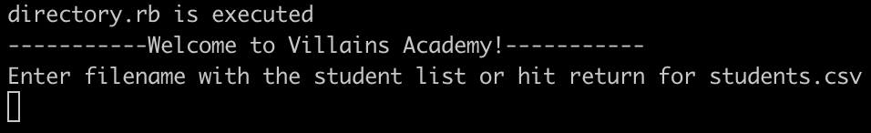

# student-directory

The student directory script allows you to manage the list of students enrolled at Villains Academy.

## How to use ##

Navigate to the directory and run the directory.rb file using ruby:
```shell
ruby directory.rb
```

The program will let you know what file is executed, greet you and prompt to enter a filename with your list of students. Pressing return will default to students.csv.

<p align="center">
  
</p>
