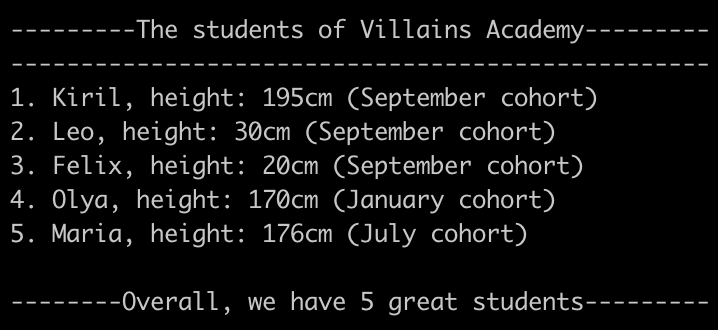
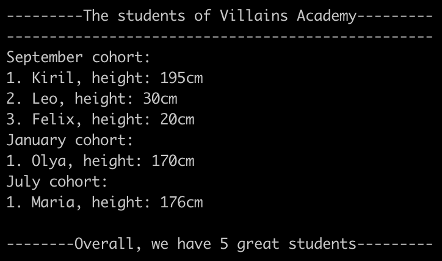
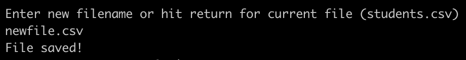
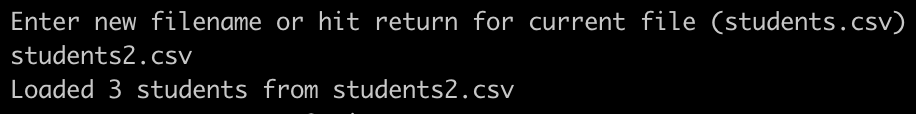

# student-directory

The student directory script allows you to manage the list of students enrolled at Villains Academy.

## How to Use ##

Navigate to the directory and run the directory.rb file using ruby:
```shell
ruby directory.rb
```

The program will let you know what file is executed, greet you and prompt to enter a filename with your list of students. Pressing return will default to students.csv.

<p align="left">
  
</p>

Once the filename has been provided, the user is either shown how many students were loaded from the file or that the file doesn't exist.

<p align="left">
  
</p>

### Main Menu ###

The main menu has 6 options and user is prompted to enter their selection:

<p align="left">
  
</p>

The options are:

1. **Input the students:**

<p align="center">
  
</p>

User needs to enter a name of a new student. If that happens, the student's height and cohort will also need to be entered. User is then notified how many students are now in Villains Academy. To finish, press return on the name entry.

2. **Show the students:**

<p align="center">
  
</p>

Shows the students' info in the order they were entered.

3. **Show the students by cohort:**

<p align="center">
  
</p>

Groups the students into their respective cohorts and outputs them.

4. **Save the list to a file:**

<p align="center">
  
</p>

Prompts user to enter the filename where to save the list to or hit return to stay on the file loaded on startup. This method will overwrite a file!

5. **Load the list from a file:**

<p align="center">
  
</p>

Prompts user to enter filename of the student list (or return for students.csv) and shows the number of students loaded from that file. If a student already exists in the list, that student will not be loaded.

9. **Exit**

Entering 9 will terminate the application.
