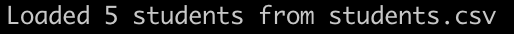
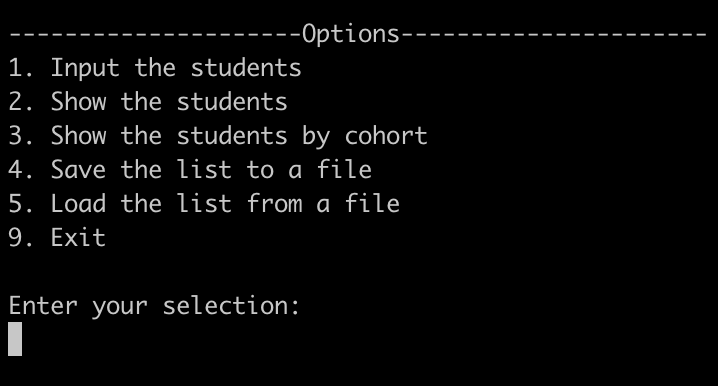
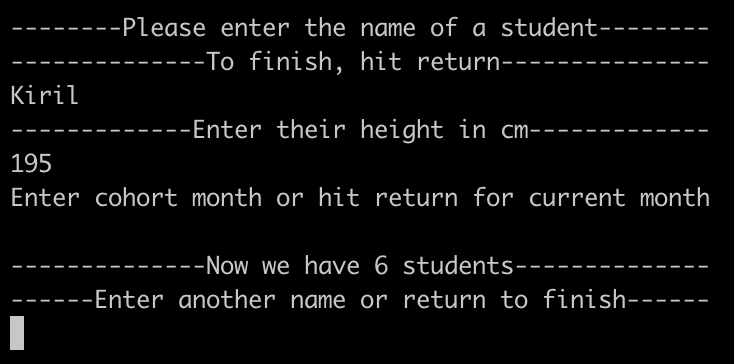

# student-directory

The student directory script allows you to manage the list of students enrolled at Villains Academy.

## How to Use ##

Navigate to the directory and run the directory.rb file using ruby:
```shell
ruby directory.rb
```

The program will let you know what file is executed, greet you and prompt to enter a filename with your list of students. Pressing return will default to students.csv.

<p align="left">
  
</p>

Once the filename has been provided, the user is either shown how many students were loaded from the file or that the file doesn't exist.

<p align="left">
  
</p>

### Main Menu ###

The main menu has 6 options and user is prompted to enter their selection:

<p align="left">
  
</p>

The options are:

1. Input the students:

<p align="left">
  
</p>

User needs to enter a name of a new student. If that happens, the student's height and cohort will also need to be entered. User is then notified how many students are now in Villains Academy. To finish, press return on the name entry.
